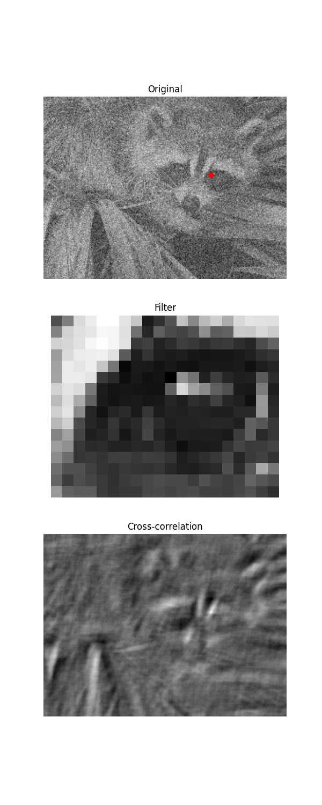
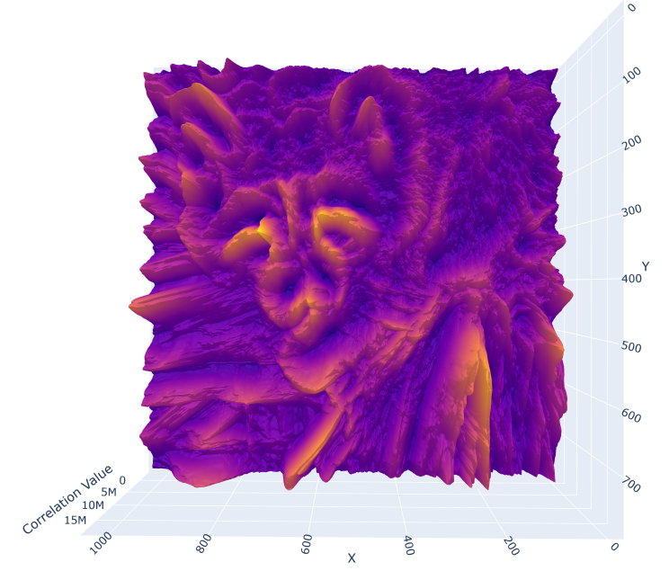

# Rotation-Invariant Stacked 2D Cross-Correlation

[Link to Interactable 3D Plot](https://ivanvoinovgithub.github.io/ivan-sdk/)

This project demonstrates the implementation of Rotation-Invarient Stacked 2D Cross-Correlation. Simply put, the process of 2D cross-correlation process is prone to poor performance in scenarios where the target of interest in the background image is not rotationally aligned with the template. In such scenarios, the cross-correlation return will be much lower. To address this, a rotation-invariant stacked 2D cross-correlation algorithm is proposed.

This algorithm takes a filter image and iteratively computes the 2D cross-correlation against a background image, rotating the filter by a set amount of degrees each step. The resulting 3 dimensional array is composed of the stacked 2D cross-correlation outputs. At this point, an aggregation function is applied across these ouputs. In this implementation, both mean and max functions are provided.

The repository includes code to compute the cross-correlation of a template image with a background image, as well as to visualize this process step-by-step in a GIF. Furthermore, this repository includes an implementation of rotational cross-correlation where the cross correlation is computed iteratively over rotated variants of the template images. Upon doing so, the stack of cross correlation outputs has an aggregate operation of mean and/or max applied. To visualize the results, an interative 3d Topographical representation may be created.

## What is 2D Cross-Correlation?

2D cross-correlation is a mathematical operation that measures the similarity between a template and regions of a larger image. It involves sliding the template over the background image and computing a correlation value at each position. The output is a 2D array where each value represents the similarity between the template and the corresponding region of the background image.

## Example

Here, we use a simple example to illustrate 2D cross-correlation.

### Cross-Correlation

### Cross-Correlation Process GIF

The following GIF shows the template sliding over the background image, with the cross-correlation values being updated.

